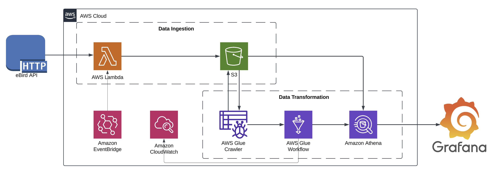
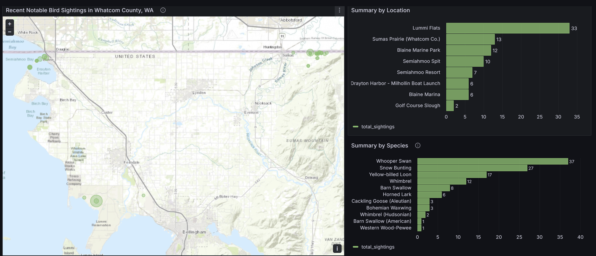

# eBird API ETL

The purpose of this pipeline is to ingest data from the eBird API to visualize in Grafana. The diagram below lays out the AWS infrastructure used to perform the ETL tasks.

## Data Sources

Data for this project comes from eBird: https://ebird.org. Specifically, the pipeline uses the ["Recent notable observations in a region"](https://documenter.getpostman.com/view/664302/S1ENwy59#397b9b8c-4ab9-4136-baae-3ffa4e5b26e4) endpoint. See eBird's description of a notable species:
> Notable observations can be for locally or nationally rare species or are otherwise unusual, e.g. over-wintering birds in a species which is normally only a summer visitor.

## Visualization

The data ingested from this pipeline can be viewed in Grafana: https://alexclippinger.grafana.net/dashboard/snapshot/oSlHPk21KhNHGuRlAPudkCBqbPjXOlWH

